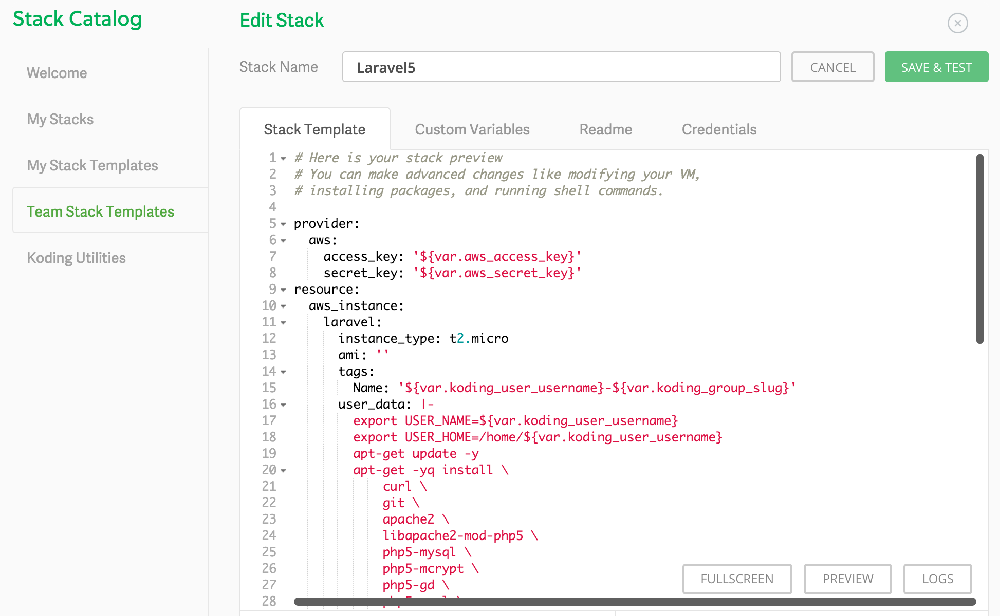
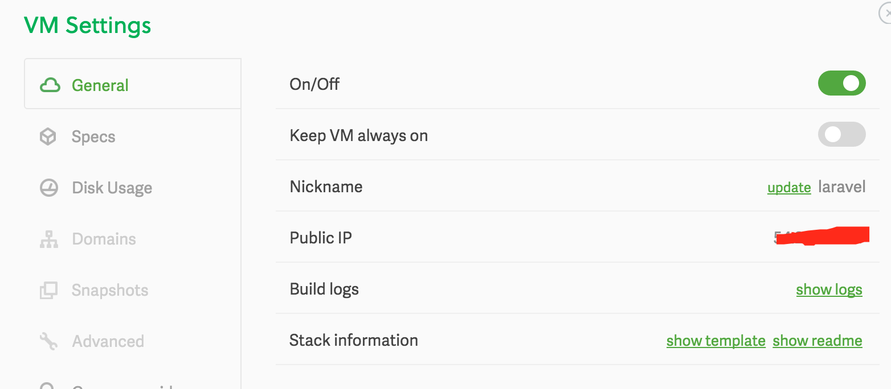

# laravel 云开发环境
支持koding.com 和 c9.io

1. koding.com
  注册帐号&建立团队stack
  
  使用koding.template

  目前只支持aws，国内建议使用新加坡节点的c2.micro
  c2的nano机器目前好像只有美国区支持
  建好团队模板后新建VM完成后执行启动命令就能开始开发

  1.启动laravel
  cd ~/workspace && sh env.laravel/start.laravel.sh  
  
  2.启动october
  cd ~/workspace && sh env.laravel/start.october.sh 
  
   
   在VM看到的这个Public IP就是应用的地址
  
  你可以使用koding.com的工具挂载远程文件夹到本地，使用本地IDE开发
  
2. c9.io
  使用koding.template的脚本，原理一样
  完成后可以使用dropbox来进行实时同步到本地来开发

  

